# Pose Generation Flow - Sequence Diagram

This sequence diagram shows the complete flow from user clicking "Generate Poses" through to pose storage, including mesh poses and posttraining poses with all their validation and raycast operations.

```mermaid
sequenceDiagram
    participant User
    participant GenerateSidebar
    participant useDataGeneratorUtils
    participant usePrecomputedPoses
    participant ProgressToast
    participant useOffscreenThree
    participant SceneManager
    participant Database
    participant get360s

    %% GENERATE POSES FLOW
    User->>GenerateSidebar: Click "Generate Poses"
    GenerateSidebar->>useDataGeneratorUtils: generatePoses()
    
    Note over useDataGeneratorUtils,Database: Load project data and check for 360° metadata
    useDataGeneratorUtils->>Database: db.projects.get(id)
    Database-->>useDataGeneratorUtils: project data
    
    par Mesh Poses Generation
        useDataGeneratorUtils->>useDataGeneratorUtils: generateMeshPoses()
        useDataGeneratorUtils->>usePrecomputedPoses: clearPoses()
        useDataGeneratorUtils->>ProgressToast: show progress (mesh poses)
        
        loop For each pose series
            useDataGeneratorUtils->>useDataGeneratorUtils: getRandomPoseInPolygons()
            
            alt If avoidWalls enabled
                useDataGeneratorUtils->>useOffscreenThree: doOffscreenRaycast(position, target)
                useOffscreenThree->>SceneManager: getOrCreateScene(512x512, doubleSided=true)
                SceneManager-->>useOffscreenThree: cached/new scene with 3D models
                useOffscreenThree->>useOffscreenThree: perform raycast on scene
                useOffscreenThree-->>useDataGeneratorUtils: intersection results
                alt If too close to wall (< wallAvoidanceThreshold)
                    useDataGeneratorUtils->>useDataGeneratorUtils: retry pose generation
                end
            end
            
            useDataGeneratorUtils->>usePrecomputedPoses: addPose(pose)
            
            alt If pair generation enabled
                useDataGeneratorUtils->>useDataGeneratorUtils: getPairPoint(pose)
                
                Note over useDataGeneratorUtils,SceneManager: Two raycasts for pair validation
                useDataGeneratorUtils->>useOffscreenThree: doOffscreenRaycast(originalPos, newPos, limitDistance=true)
                useOffscreenThree->>SceneManager: getOrCreateScene(512x512, doubleSided=true)
                SceneManager-->>useOffscreenThree: cached scene
                useOffscreenThree-->>useDataGeneratorUtils: check if path goes through wall
                alt If path blocked
                    useDataGeneratorUtils->>useDataGeneratorUtils: retry pair generation
                end
                
                alt If avoidWalls enabled
                    useDataGeneratorUtils->>useOffscreenThree: doOffscreenRaycast(newPos, newTarget)
                    useOffscreenThree->>SceneManager: getOrCreateScene(512x512, doubleSided=true)
                    SceneManager-->>useOffscreenThree: cached scene
                    useOffscreenThree-->>useDataGeneratorUtils: check wall proximity
                    alt If too close to wall
                        useDataGeneratorUtils->>useDataGeneratorUtils: retry pair generation
                    end
                end
                
                useDataGeneratorUtils->>usePrecomputedPoses: addPose(pairPose)
            end
            
            useDataGeneratorUtils->>ProgressToast: update progress
        end
        
        useDataGeneratorUtils->>ProgressToast: dismiss toast
        useDataGeneratorUtils->>User: "Mesh pose generation complete"
    
    and Posttraining Poses Generation
        alt If 360° metadata available
            useDataGeneratorUtils->>useDataGeneratorUtils: generatePosttrainingPoses()
            useDataGeneratorUtils->>usePrecomputedPoses: clearPosttrainingPoses()
            
            Note over useDataGeneratorUtils,Database: Load 360° image positions from metadata
            useDataGeneratorUtils->>get360s: get360s(project, withImages=false)
            get360s->>Database: parse metadata file
            get360s-->>useDataGeneratorUtils: array of 360° positions
            
            useDataGeneratorUtils->>ProgressToast: show progress (posttraining poses)
            
            loop For each 360° image position
                loop For numPosttrainingImages
                    useDataGeneratorUtils->>useDataGeneratorUtils: create pose at 360° position
                    
                    alt If avoidWalls enabled
                        useDataGeneratorUtils->>useOffscreenThree: doOffscreenRaycast(pos, target)
                        useOffscreenThree->>SceneManager: getOrCreateScene(512x512, doubleSided=true)
                        SceneManager-->>useOffscreenThree: cached scene
                        useOffscreenThree-->>useDataGeneratorUtils: check wall proximity
                        alt If too close to wall
                            Note over useDataGeneratorUtils: Skip pose and retry (i--)
                        end
                    end
                    
                    useDataGeneratorUtils->>usePrecomputedPoses: addPosttrainingPose(pose)
                    
                    alt If pair generation enabled
                        useDataGeneratorUtils->>useDataGeneratorUtils: getPairPoint(pose)
                        
                        useDataGeneratorUtils->>useOffscreenThree: doOffscreenRaycast(originalPos, newPos, limitDistance=true)
                        useOffscreenThree->>SceneManager: getOrCreateScene(512x512, doubleSided=true)
                        SceneManager-->>useOffscreenThree: cached scene
                        useOffscreenThree-->>useDataGeneratorUtils: check if path goes through wall
                        
                        alt If avoidWalls enabled
                            useDataGeneratorUtils->>useOffscreenThree: doOffscreenRaycast(newPos, newTarget)
                            useOffscreenThree->>SceneManager: getOrCreateScene(512x512, doubleSided=true)
                            SceneManager-->>useOffscreenThree: cached scene
                            useOffscreenThree-->>useDataGeneratorUtils: check wall proximity
                        end
                        
                        useDataGeneratorUtils->>usePrecomputedPoses: addPosttrainingPose(pairPose)
                    end
                end
                useDataGeneratorUtils->>ProgressToast: update progress
            end
            
            useDataGeneratorUtils->>ProgressToast: dismiss toast
            useDataGeneratorUtils->>User: "Posttraining pose generation complete"
        end
    end

    %% OPTIONAL USER INTERACTIONS
    Note over User,ProgressToast: User can click "Stop" on any progress toast
    ProgressToast-->>useDataGeneratorUtils: stop signal
    useDataGeneratorUtils->>User: "Process stopped"
```

## Key Flow Points

### Database Initialization
- Project data loaded at start to check for 360° metadata availability
- Determines which pose generation flows will be executed

### Mesh Pose Generation
1. **Random Position Generation**: Within polygon triangulations with height offset
2. **Wall Avoidance**: Optional raycast validation using cached 3D scenes
3. **Pair Generation**: Optional secondary poses with dual raycast validation
4. **Progress Management**: Real-time updates with user stop functionality

### Posttraining Pose Generation
1. **360° Position Loading**: Metadata parsed to extract camera positions
2. **Pose Creation**: Generated at 360° image locations with random orientations
3. **Same Validation**: Wall avoidance and pair generation using identical raycast logic
4. **Parallel Execution**: Runs simultaneously with mesh pose generation

### Scene Management
- **Caching**: SceneManager reuses 3D scenes across multiple raycast operations
- **Performance**: Avoids rebuilding scenes for each validation check
- **Flexibility**: Supports different scene configurations (doubleSided, dimensions)

### Key Interactions
- All raycast operations go through SceneManager for performance
- Progress toasts provide real-time feedback and user control
- Poses stored immediately in usePrecomputedPoses store
- Error handling and retry logic for failed pose validation