# Pose Generation and Screenshot Flow - Sequence Diagram

This sequence diagram visualizes the complete flow from user clicking "Generate Poses" through to completing screenshot generation, showing the interactions between UI components, hooks, stores, and the various screenshot types (mesh with shaded/unshaded variants and 360° screenshots).

```mermaid
sequenceDiagram
    participant User
    participant GenerateSidebar
    participant useDataGeneratorUtils
    participant usePrecomputedPoses
    participant ProgressToast
    participant useOffscreenThree
    participant SceneManager
    participant Database
    participant get360s
    participant FileSystem

    %% GENERATE POSES FLOW
    User->>GenerateSidebar: Click "Generate Poses"
    GenerateSidebar->>useDataGeneratorUtils: generatePoses()
    
    Note over useDataGeneratorUtils,Database: Load project data and check for 360° metadata
    useDataGeneratorUtils->>Database: db.projects.get(id)
    Database-->>useDataGeneratorUtils: project data
    
    par Mesh Poses Generation
        useDataGeneratorUtils->>useDataGeneratorUtils: generateMeshPoses()
        useDataGeneratorUtils->>usePrecomputedPoses: clearPoses()
        useDataGeneratorUtils->>ProgressToast: show progress (mesh poses)
        
        loop For each pose series
            useDataGeneratorUtils->>useDataGeneratorUtils: getRandomPoseInPolygons()
            
            alt If avoidWalls enabled
                useDataGeneratorUtils->>useOffscreenThree: doOffscreenRaycast(position, target)
                useOffscreenThree->>SceneManager: getOrCreateScene(512x512, doubleSided=true)
                SceneManager-->>useOffscreenThree: cached/new scene with 3D models
                useOffscreenThree->>useOffscreenThree: perform raycast on scene
                useOffscreenThree-->>useDataGeneratorUtils: intersection results
                alt If too close to wall (< wallAvoidanceThreshold)
                    useDataGeneratorUtils->>useDataGeneratorUtils: retry pose generation
                end
            end
            
            useDataGeneratorUtils->>usePrecomputedPoses: addPose(pose)
            
            alt If pair generation enabled
                useDataGeneratorUtils->>useDataGeneratorUtils: getPairPoint(pose)
                
                Note over useDataGeneratorUtils,SceneManager: Two raycasts for pair validation
                useDataGeneratorUtils->>useOffscreenThree: doOffscreenRaycast(originalPos, newPos, limitDistance=true)
                useOffscreenThree->>SceneManager: getOrCreateScene(512x512, doubleSided=true)
                SceneManager-->>useOffscreenThree: cached scene
                useOffscreenThree-->>useDataGeneratorUtils: check if path goes through wall
                alt If path blocked
                    useDataGeneratorUtils->>useDataGeneratorUtils: retry pair generation
                end
                
                alt If avoidWalls enabled
                    useDataGeneratorUtils->>useOffscreenThree: doOffscreenRaycast(newPos, newTarget)
                    useOffscreenThree->>SceneManager: getOrCreateScene(512x512, doubleSided=true)
                    SceneManager-->>useOffscreenThree: cached scene
                    useOffscreenThree-->>useDataGeneratorUtils: check wall proximity
                    alt If too close to wall
                        useDataGeneratorUtils->>useDataGeneratorUtils: retry pair generation
                    end
                end
                
                useDataGeneratorUtils->>usePrecomputedPoses: addPose(pairPose)
            end
            
            useDataGeneratorUtils->>ProgressToast: update progress
        end
        
        useDataGeneratorUtils->>ProgressToast: dismiss toast
        useDataGeneratorUtils->>User: "Mesh pose generation complete"
    
    and Posttraining Poses Generation
        alt If 360° metadata available
            useDataGeneratorUtils->>useDataGeneratorUtils: generatePosttrainingPoses()
            useDataGeneratorUtils->>usePrecomputedPoses: clearPosttrainingPoses()
            
            Note over useDataGeneratorUtils,Database: Load 360° image positions from metadata
            useDataGeneratorUtils->>get360s: get360s(project, withImages=false)
            get360s->>Database: parse metadata file
            get360s-->>useDataGeneratorUtils: array of 360° positions
            
            useDataGeneratorUtils->>ProgressToast: show progress (posttraining poses)
            
            loop For each 360° image position
                loop For numPosttrainingImages
                    useDataGeneratorUtils->>useDataGeneratorUtils: create pose at 360° position
                    
                    alt If avoidWalls enabled
                        useDataGeneratorUtils->>useOffscreenThree: doOffscreenRaycast(pos, target)
                        useOffscreenThree->>SceneManager: getOrCreateScene(512x512, doubleSided=true)
                        SceneManager-->>useOffscreenThree: cached scene
                        useOffscreenThree-->>useDataGeneratorUtils: check wall proximity
                        alt If too close to wall
                            Note over useDataGeneratorUtils: Skip pose and retry (i--)
                        end
                    end
                    
                    useDataGeneratorUtils->>usePrecomputedPoses: addPosttrainingPose(pose)
                    
                    alt If pair generation enabled
                        useDataGeneratorUtils->>useDataGeneratorUtils: getPairPoint(pose)
                        
                        useDataGeneratorUtils->>useOffscreenThree: doOffscreenRaycast(originalPos, newPos, limitDistance=true)
                        useOffscreenThree->>SceneManager: getOrCreateScene(512x512, doubleSided=true)
                        SceneManager-->>useOffscreenThree: cached scene
                        useOffscreenThree-->>useDataGeneratorUtils: check if path goes through wall
                        
                        alt If avoidWalls enabled
                            useDataGeneratorUtils->>useOffscreenThree: doOffscreenRaycast(newPos, newTarget)
                            useOffscreenThree->>SceneManager: getOrCreateScene(512x512, doubleSided=true)
                            SceneManager-->>useOffscreenThree: cached scene
                            useOffscreenThree-->>useDataGeneratorUtils: check wall proximity
                        end
                        
                        useDataGeneratorUtils->>usePrecomputedPoses: addPosttrainingPose(pairPose)
                    end
                end
                useDataGeneratorUtils->>ProgressToast: update progress
            end
            
            useDataGeneratorUtils->>ProgressToast: dismiss toast
            useDataGeneratorUtils->>User: "Posttraining pose generation complete"
        end
    end

    %% TAKE SCREENSHOTS FLOW
    Note over User,FileSystem: User can now click "Take Screenshots"
    
    User->>GenerateSidebar: Click "Take Screenshots"
    GenerateSidebar->>useDataGeneratorUtils: takeScreenshots()
    useDataGeneratorUtils->>FileSystem: create ZIP with timestamp
    
    par Mesh Screenshots
        useDataGeneratorUtils->>useOffscreenThree: takeOffscreenScreenshots(poses, width, height)
        useOffscreenThree->>ProgressToast: show progress (screenshots)
        
        alt If 360° shading enabled
            useOffscreenThree->>useOffscreenThree: takeOffscreenScreenshotsShaded()
            
            Note over useOffscreenThree,Database: Load 360° images for lighting
            useOffscreenThree->>get360s: get360s(project, withImages=true)
            get360s->>Database: db.getImages360(projectId)
            Database-->>get360s: 360° image blobs
            get360s->>get360s: load textures via THREE.TextureLoader
            get360s-->>useOffscreenThree: 360° images with textures
            
            useOffscreenThree->>SceneManager: getOrCreateScene(width, height, doubleSided=false, use360Shading=true)
            SceneManager-->>useOffscreenThree: scene with 3D models
            
            Note over useOffscreenThree: Creates multiple render targets per pose<br/>Uses 360° images as lighting sources<br/>Composites final image via post-processing
            
            loop For each pose
                useOffscreenThree->>useOffscreenThree: find nearby 360° images
                useOffscreenThree->>useOffscreenThree: create point lights at 360° positions
                
                loop For each light
                    useOffscreenThree->>useOffscreenThree: render to separate target
                end
                
                useOffscreenThree->>useOffscreenThree: composite via post-processing quad
                useOffscreenThree->>ProgressToast: update progress
            end
        else Ambient lighting only
            useOffscreenThree->>useOffscreenThree: takeOffscreenScreenshotsAmbient()
            useOffscreenThree->>SceneManager: getOrCreateScene(width, height, doubleSided=false)
            SceneManager-->>useOffscreenThree: scene with 3D models
            
            loop For each pose
                useOffscreenThree->>useOffscreenThree: render with ambient lighting
                useOffscreenThree->>ProgressToast: update progress
            end
        end
        
        useOffscreenThree->>FileSystem: save screenshots to mesh folder
        useOffscreenThree->>FileSystem: save pose metadata (JSON)
        useOffscreenThree->>ProgressToast: dismiss toast
        useOffscreenThree->>User: "Screenshots complete"
    
    and 360° Screenshots
        alt If posttraining poses exist
            useDataGeneratorUtils->>useOffscreenThree: take360Screenshots(posttrainingPoses, width, height)
            
            Note over useOffscreenThree,Database: Load and validate 360° images
            useOffscreenThree->>get360s: get360s(project, withImages=true)
            get360s->>Database: db.getImages360(projectId)
            Database-->>get360s: 360° image blobs
            get360s->>get360s: load textures via THREE.TextureLoader
            get360s-->>useOffscreenThree: 360° images with textures
            
            useOffscreenThree->>useOffscreenThree: createScene360(width, height)
            Note over useOffscreenThree: Creates sphere scene for 360° rendering
            
            useOffscreenThree->>ProgressToast: show progress (360° screenshots)
            
            loop For each posttraining pose
                useOffscreenThree->>useOffscreenThree: load corresponding 360° image texture
                useOffscreenThree->>useOffscreenThree: apply texture to sphere
                useOffscreenThree->>useOffscreenThree: rotate sphere by course value
                useOffscreenThree->>useOffscreenThree: render from pose perspective
                useOffscreenThree->>ProgressToast: update progress
            end
            
            useOffscreenThree->>FileSystem: save screenshots to posttraining folder
            useOffscreenThree->>FileSystem: save pose metadata (JSON)
            useOffscreenThree->>ProgressToast: dismiss toast
            useOffscreenThree->>User: "Screenshots complete"
        end
    end
    
    useDataGeneratorUtils->>FileSystem: finalize and download ZIP
    useDataGeneratorUtils->>User: Download "screenshots.zip"

    %% OPTIONAL USER INTERACTIONS
    Note over User,ProgressToast: User can click "Stop" on any progress toast
    ProgressToast-->>useDataGeneratorUtils: stop signal
    useDataGeneratorUtils->>User: "Process stopped"
```

## Key Flow Points

### Generate Poses Phase
1. **Parallel Execution**: Mesh and posttraining pose generation run simultaneously
2. **Progress Feedback**: Real-time progress updates with stop functionality
3. **Conditional Logic**: Posttraining only runs if 360° metadata exists
4. **Pair Generation**: Optional secondary poses generated for each primary pose

### Take Screenshots Phase
1. **Dual Screenshot Types**: 
   - **Mesh Screenshots**: 3D model renders (shaded vs unshaded variants)
   - **360° Screenshots**: Spherical environment renders
2. **Shading Variants**:
   - **Unshaded**: Simple ambient lighting
   - **Shaded**: Complex multi-light setup using 360° images as light sources
3. **File Organization**: Screenshots saved in structured ZIP with metadata
4. **Progress Management**: Stoppable processes with user feedback

### Key Interactions
- Store updates happen in real-time during pose generation
- Screenshot generation depends on pose availability
- Progress toasts provide user control over long-running operations
- File system operations are batched for efficiency