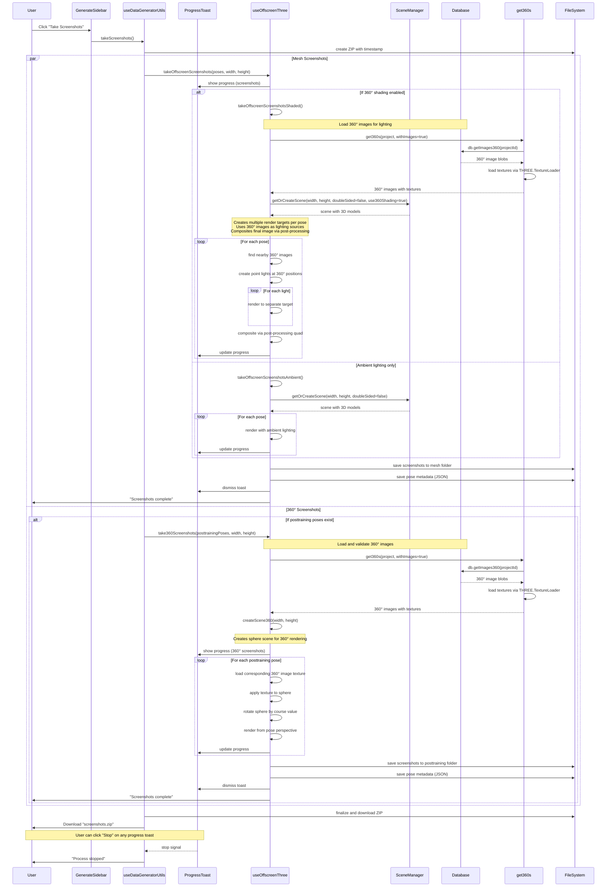

# Screenshot Generation Flow - Sequence Diagram

This sequence diagram shows the complete flow from user clicking "Take Screenshots" through to ZIP file download, including both mesh screenshots (shaded/unshaded variants) and 360° screenshots with all their rendering processes.



## Key Flow Points

### Screenshot Types and Variants

#### Mesh Screenshots
1. **Shaded Variant**:
   - Loads 360° images from database with full textures
   - Creates complex lighting setup using 360° images as point light sources
   - Multiple render targets per pose for different light contributions
   - Post-processing compositing for final image output

2. **Unshaded Variant**:
   - Simple ambient lighting without 360° image integration
   - Single render pass per pose
   - Faster rendering pipeline

#### 360° Screenshots
1. **Spherical Environment Rendering**:
   - Uses dedicated sphere scene with 360° image textures
   - Camera positioned at origin, looking outward at textured sphere
   - Texture rotation based on course metadata
   - Specialized for posttraining pose perspectives

### File Organization
1. **ZIP Structure**:
   ```
   screenshots_[timestamp]/
   ├── mesh/
   │   ├── screenshot_[series][a/b].png
   │   └── screenshot_[series][a/b].json
   └── posttraining/
       ├── screenshot_[series][a/b].png
       └── screenshot_[series][a/b].json
   ```

2. **Metadata Storage**:
   - JSON files contain pose data, camera settings, and image dimensions
   - Enables reconstruction of camera positions for analysis

### Scene Management
- **Mesh Rendering**: Uses SceneManager for cached 3D model scenes
- **360° Rendering**: Creates dedicated sphere scenes with texture management
- **Performance**: Scene reuse across multiple poses reduces setup overhead

### Progress Management
- **Parallel Execution**: Mesh and 360° screenshots generated simultaneously
- **Real-time Updates**: Progress bars show completion percentage
- **User Control**: Stop functionality available during long operations
- **Success Feedback**: Toast notifications for completion status

### Key Technical Details
- **Render Targets**: Multiple framebuffers for advanced lighting effects
- **Texture Loading**: THREE.TextureLoader for 360° image processing
- **Post-processing**: Shader-based compositing for shaded variants
- **Memory Management**: Proper cleanup of textures and render targets